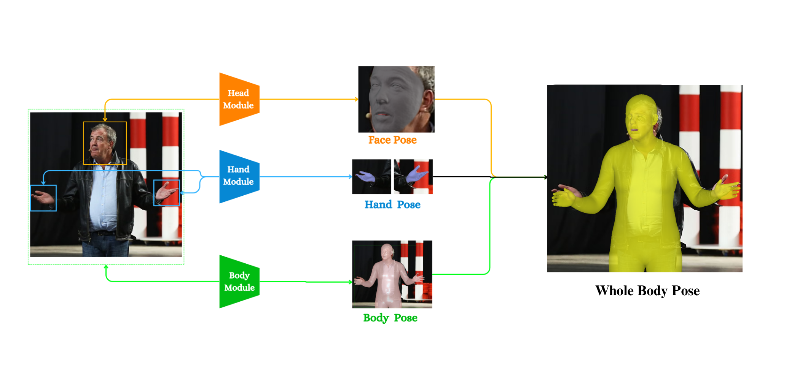
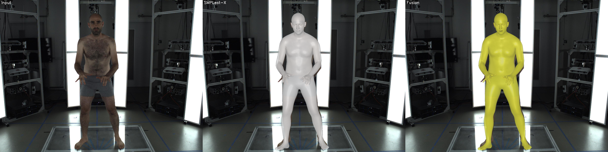

# Robust Full Body 3D Human Pose Estimation

[](https://www.python.org/)
[](https://pytorch.org/)
[](LICENSE)
[](https://drive.google.com/file/d/1ie_sMKMxkpYcWUKtagHiUPQcNsE5KhLF/view?usp=sharing)

> **Ongoing Implementation** of the Master's Thesis: *Robust Full Body 3D Human Pose Estimation* (AIMS South Africa, 2025).

## 📝 Abstract
[**📄 Read the full Master's Thesis here**](https://drive.google.com/file/d/1ie_sMKMxkpYcWUKtagHiUPQcNsE5KhLF/view?usp=sharing)

Despite the presence of expert models for specific body parts (e.g., hands and faces), existing unified approaches often fail to deliver consistent, high-fidelity 3D representations of the entire human body.

This repository implements a **Composition-of-Experts Framework**. Instead of training a monolithic network, this pipeline strategically fuses state-of-the-art specialized models within the unified SMPL-X parameter space:

* **Body:** [SMPLest-X](https://github.com/smplest-x) for global pose and shape.
* **Hands:** [WiLoR](https://github.com/wilor) for high-fidelity hand articulation.
* **Face:** [EMOCA](https://github.com/emoca) for expressive facial geometry.

The result is a unified mesh that preserves the sub-millimeter accuracy of expert models while maintaining global anatomical coherence.

## 🏗️ Architecture



The pipeline operates in four stages:
1.  **Global Estimation:** Inferring base body parameters using SMPLest-X.
2.  **Expert Extraction:** Regressing high-fidelity parameters for hands (WiLoR) and face (EMOCA).
3.  **Parameter Transformation:** Aligning expert coordinate systems (e.g., specific mirroring for left-hand MANO parameters) to the SMPL-X standard.
4.  **Fusion:** Synthesizing the final mesh.

## 🖼️ Qualitative Results

Our method demonstrates significant improvements in capturing fine-grained anatomical details compared to the baseline.

### 1. Expressive Facial Reconstruction
Standard body models often produce neutral expressions even when the subject is emotional. By integrating EMOCA, our pipeline faithfully recovers open-mouth laughter and subtle cheek dynamics.


*(From left to right: Input Image, SMPLest-X Baseline, **Ours (Fusion)**)*

### 2. Complex Hand Articulation
Baseline methods frequently misinterpret finger orientation in subtle poses. As seen below, the baseline (middle) renders fingers as stiff and unnaturally splayed. Our fusion approach (right) leverages WiLoR to correctly recover the natural downward reach and precise finger spacing, matching the input faithfully.


*(Comparison of finger alignment: Input vs. Baseline vs. Ours)*

## 📂 Repository Structure

```text
3d_whole_body_pipeline/
├── adapters/           # Interface wrappers for WiLoR, EMOCA, and SMPLest-X
├── analysis_tools/     # Scripts for visualizing parameter distributions
├── bash_scripts/       # Automation for large-scale evaluation
├── data/               # Input images and output storage
├── evaluation/         # Evaluation scripts (V2V, PA-V2V metrics)
├── fusion/             # Core logic for Parameter Composition & Transformation
├── pretrained_models/  # Checkpoints for SMPLest-X, WiLoR, etc.
└── main.py             # Entry point for the inference pipeline
````

## 🛠️ Installation

1.  **Clone the repository:**

    ```bash
    git clone --recursive [https://github.com/Roda10/3d_whole_body_pipeline.git](https://github.com/Roda10/3d_whole_body_pipeline.git)
    cd 3d_whole_body_pipeline
    ```

2.  **Set up the environment:**

    ```bash
    conda create -n fusion_body python=3.10
    conda activate fusion_body
    pip install -r requirements.txt

    # Required to avoid Protocol Buffer errors
    export PROTOCOL_BUFFERS_PYTHON_IMPLEMENTATION=python
    ```

3.  **Data & Model Setup:**
    Ensure your directories are structured as follows:

    ```text
    data/
    ├── full_images/        # Your input images
    ├── EHF/                # EHF dataset (for evaluation)
    └── outputs/            # Pipeline outputs

    pretrained_models/
    └── smplest_x/          # Place SMPLest-X model files here
    ```

## 🚀 Usage

### 1\. Run the Complete Pipeline

To run the fusion of all three models (SMPLest-X, WiLoR, and EMOCA) on a single image:

```bash
python main.py --input_image data/full_images/test2.jpg --output_dir pipeline_results
```

**Output Location:**
Results will be saved in `pipeline_results/run_TIMESTAMP/`. This directory contains:

  * Individual model results (SMPLest-X, WiLoR, EMOCA folders)
  * `pipeline_summary.json`
  * Execution logs

### 2\. Run Evaluation (EHF Dataset)

We provide scripts to automate evaluation on the EHF dataset.

**Option A: Automated Script (Recommended)**

```bash
# Start evaluation
./bash_scripts/run_eval.sh start

# Check status or view logs
./bash_scripts/run_eval.sh status
./bash_scripts/run_eval.sh logs
```

**Option B: Quick Python Test**

```bash
# Evaluate on a subset (e.g., 10 frames)
python evaluation/ehf_fusion_evaluator.py --max_frames 10 --verbose_output
```

### 3\. Advanced Analysis Tools

For debugging or visualizing intermediate parameters:

```bash
# Visualize fusion results
python fusion/fusion_visualizer.py --results_dir pipeline_results/run_TIMESTAMP

# Analyze parameter distribution
python analysis_tools/parameter_analyzer.py --results_dir pipeline_results/run_TIMESTAMP
```

## 🎓 Citation

If you find this work useful for your research, please cite the thesis:

```bibtex
@mastersthesis{toha2025robust,
  title={Robust Full Body 3D Human Pose Estimation},
  author={Toha, Rodéo Oswald Y.},
  school={African Institute for Mathematical Sciences (AIMS), South Africa},
  year={2025},
  month={June},
  note={Supervised by Dr. Rolandos Alexandros Potamias and Dr. Jiankang Deng}
}
```

## 🙏 Acknowledgements

This research was conducted at the **African Institute for Mathematical Sciences (AIMS), South Africa**, and supervised by Dr. Rolandos Alexandros Potamias and Dr. Jiankang Deng. We utilize code from the open-source community, specifically the implementations of SMPL-X, WiLoR, and EMOCA.